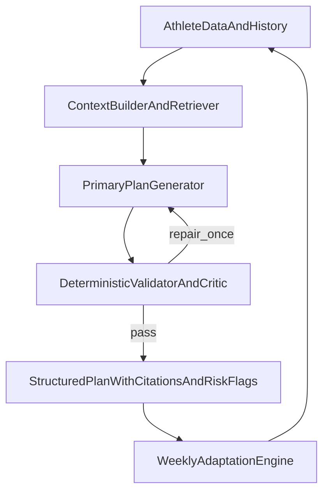

# SOTA AI + Running Training Study and Roadmap

## Purpose

This document captures a state-of-the-art (SOTA) study and translates it into a practical product roadmap for `run-zone-ai`.
It combines:

- modern AI system design (reliability, grounding, evaluation, safety)
- current endurance-training evidence (load management, intensity distribution, recovery signals)

The goal is to increase plan quality, personalization depth, and safety without uncontrolled complexity.

---

## Scope and assumptions

- Scope: weekly plan and training block generation, plus coach-style chat guidance.
- User profile: recreational to advanced runners; not a clinical diagnosis tool.
- Product constraint: reliability and explainability are prioritized over raw novelty.

---

## Study method

We reviewed:

- current internal architecture and AI-improvement docs in `docs/ai-improvement/`
- recent AI production guidance (grounding, retrieval/reranking, risk frameworks, eval methods)
- recent endurance evidence (intensity distribution effects, HRV-guided adaptation, injury/load forecasting literature)

We use evidence directionally for product decisions, then require local offline/online validation before rollout.

---

## Key findings from AI field

## 1) Grounded outputs are a major reliability lever

- Best practice: require evidence-backed outputs when making factual training claims.
- Practical implication: add citation-required mode for training-science statements.
- UX implication: if evidence is weak or missing, downgrade confidence or ask clarifying questions.

## 2) Retrieval quality matters more than bigger context alone

- Long context can degrade quality when irrelevant chunks are added.
- Practical implication: prioritize hybrid retrieval + reranking + athlete-context weighting.
- Expected win: fewer generic or contradictory recommendations.

## 3) Bounded critic loops outperform uncontrolled agent complexity

- A deterministic validator/critic pass with one repair attempt is usually high ROI.
- Practical implication: keep one-pass generation plus one constrained repair; avoid open-ended agent swarms.

## 4) Evaluation must be multi-dimensional

- Accuracy alone is insufficient for production quality.
- Practical implication: evaluate reliability, safety, personalization fidelity, latency, and cost together.

## 5) Risk governance should be explicit

- Use a lightweight risk framework (inspired by NIST GenAI profile thinking) for confabulation/safety handling.
- Practical implication: define refusal and uncertainty policies up front, then enforce in runtime checks.

---

## Key findings from running-training field

## 1) Intensity distribution response is athlete-dependent

- Polarized training is not universally best for all runners and all outcomes.
- Practical implication: do not hard-code one model; generate and rank alternatives by athlete profile and response trend.

## 2) Recovery/readiness signals improve adaptation decisions

- HRV-guided strategies often show small-to-moderate gains or fewer negative responders in some cohorts.
- Practical implication: when HRV/sleep/resting-HR/RPE exist, use them to modulate intensity and progression.
- Fallback: default to conservative progression when data quality is low.

## 3) Injury risk is multifactorial

- Single metrics (including ACWR alone) are useful but incomplete and method-sensitive.
- Practical implication: use multi-signal risk scoring (load, monotony/strain, spikes, recovery deterioration, adherence drift).
- UX implication: provide top risk contributors and mitigation actions, not only a raw score.

---

## Proposed feature architecture

---

## Feature tracks (advanced)

## Track A: Evidence-grounded AI reliability

- Add citation-required response mode for training-science assertions.
- Add confidence policy:
  - high confidence: direct recommendation
  - medium confidence: recommendation + caveat
  - low confidence: clarifying question or safe refusal
- Add constrained critic pass:
  - schema checks
  - semantic checks
  - guardrail checks
  - max one repair attempt

## Track B: Athlete digital twin adaptation

- Build per-athlete response model from history:
  - load -> fatigue
  - load -> performance trend
  - intervention -> adherence probability
- Generate weekly counterfactuals (polarized/pyramidal/threshold bias) and rank by:
  - expected performance benefit
  - injury-risk penalty
  - adherence feasibility
- Output chosen plan + short rationale for why it won.

## Track C: Injury-risk and recovery intelligence

- Compute multi-signal risk score each week/day:
  - acute/chronic trends
  - monotony and strain
  - intensity spike flags
  - readiness deterioration flags
- Create automatic mitigation suggestions:
  - reduce high-intensity density
  - add recovery session
  - swap hard workout order
- Expose explainability payload in output:
  - `risk_level`
  - `top_contributors[]`
  - `recommended_actions[]`

## Track D: Scientific policy and safety boundaries

- Separate high-certainty vs low-certainty recommendations in generated text.
- Athlete-level guardrails by training age and recent consistency.
- Red-flag pathways (pain/injury symptom patterns) redirect to physio/clinical caution flows.

## Track E: Evaluation and research ops

- Extend test suite beyond prompt clauses:
  - plan validity and constraint checks
  - personalization fidelity tests
  - robustness to missing/noisy signals
  - repeatability across seed/model updates
- Add cohort replay benchmark from historical athlete weeks.
- Add release gates:
  - quality gain threshold
  - no safety regression
  - latency ceiling
  - cost ceiling

---

## Rollout plan

## Phase 1 (high ROI)

- citation-grounded outputs
- confidence/refusal policy
- deterministic critic + one repair
- baseline risk scoring
- expanded eval harness

## Phase 2 (adaptive intelligence)

- digital twin model v1
- counterfactual weekly option ranking
- cohort replay A/B pipeline

## Phase 3 (advanced personalization)

- athlete-archetype policy tuning
- calibration loops from feedback + outcomes
- stricter promotion gates for complex logic

---

## Data and telemetry requirements

- Inputs: runs, pace/HR, session RPE, completion/adherence, optional HRV/sleep/resting-HR.
- Derived features: monotony, strain, ACWR variants, compliance trend, readiness trend.
- AI telemetry: trace id, prompt hash/version, validation outcomes, repair reason, latency/tokens.
- Product telemetry: feedback reason taxonomy, plan acceptance/edit rate, injury-flag frequency.

---

## KPI framework

- **Reliability**
  - schema/semantic failure rate
  - repair success rate
  - grounded response coverage
- **Safety**
  - unsafe recommendation incident rate
  - red-flag handling correctness
- **Personalization**
  - adherence lift vs baseline
  - week-over-week plan edit reduction
  - performance proxy improvements
- **Operational**
  - p95 latency
  - token cost per successful plan
  - trace coverage ratio

---

## Risks and mitigation

- Overfitting to noisy wearable data -> use confidence scoring and conservative fallback.
- False precision in injury prediction -> expose probabilistic risk, not deterministic claims.
- Latency/cost inflation from extra checks -> bound retries and monitor p95/cost gates.
- Complexity creep -> phase-gate each track with explicit promotion criteria.

---

## References (starting set for implementation notes)

- NIST GenAI Risk Management Profile (2024): trustworthiness and confabulation risk framing.
- Sports Medicine meta-analysis (2024): polarized vs other intensity distributions (context-dependent benefits).
- HRV-guided training meta-analyses and trials: mixed but useful personalization signal, especially in selected populations.
- Recent retrieval/reranking literature (2024): long-context quality depends on evidence selection and ranking.

Note: during implementation, convert this starting set into a pinned bibliography file with exact citations (DOI/PMID/arXiv IDs) and evidence-quality grading.

See also: `docs/ai-improvement/multi-agent-interaction-patterns.md` for bounded production interaction patterns chosen for this codebase.

